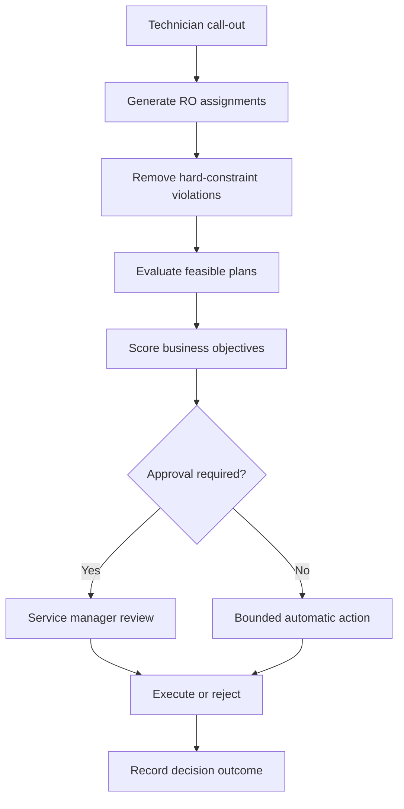

# FieldOps AI

FieldOps AI is an agentic automotive service-operations platform for constraint-based shop loading, same-day repair-order recovery, human approval, policy optimization, and auditable operational decisions.

**Live application:** [fieldops-ai.up.railway.app](https://fieldops-ai.up.railway.app/)

## The operational problem

Dealership service plans deteriorate when technicians become unavailable, diagnostic work expands, parts are delayed, or urgent repair orders arrive. A shop foreman or service manager must quickly determine which promised completion times can be preserved, which technicians are qualified, and which recovery plan creates the lowest operational cost without violating customer commitments.

FieldOps AI demonstrates how a bounded decision system can evaluate those tradeoffs while keeping consequential actions under human control.

## Current capabilities

- Live service command center with repair-order, technician, promise-time, shop-efficiency, and risk indicators
- Deterministic recovery optimizer that evaluates technician reassignment combinations
- Hard constraints for OEM certification, bay and equipment access, parts, shift availability, and technician capacity
- Weighted business objectives for promise-time protection, workflow movement, workload, overtime, and schedule stability
- Dynamic policy controls that recalculate the recommended plan
- Human approval boundary for customer rescheduling and other consequential actions
- Explainable recovery plans with rejected candidates, assignment impact, and decision criteria
- Authenticated operator roles for technician, dispatcher, supervisor, and admin actions
- Durable PostgreSQL state for technicians, work orders, policies, disruptions, plans, assignments, and audits
- Idempotent event ingestion and optimistic concurrency checks for policies and plan transitions
- Guarded plan lifecycle with approval, execution, rejection, and compensating rollback
- Immutable decision stream backed by operational audit records
- AgentOps control tower for fleet health, cost, latency, escalation, and incident monitoring
- Versioned agent release pipeline with evaluation, shadow, production, and rollback stages
- Five enforced release gates covering task success, policy compliance, hallucinations, tool accuracy, and latency
- Immutable evaluation runs with deterministic 500-case suites and categorized failure evidence
- Server-enforced promotion controls that block unsafe agent versions
- Evidence-grounded technician diagnostics with ranked hypotheses, cited sources, safety acknowledgement, and parts availability
- Versioned diagnostic runs, immutable tool execution, escalation, and first-time-fix outcome capture
- Versioned 14-day demand forecasts with backtest WAPE, bias, prediction-interval coverage, and skill-level capacity risk
- Capacity scenarios for demand, technician availability, overtime, and cross-trained staffing with explicit supervisor approval
- Enterprise-scale benchmark suite across 1,000 to 100,000 synthetic work orders
- Measured constraint-kernel throughput and p95 shard latency with deterministic replay verification
- Five regression gates for profile completion, determinism, hard constraints, throughput, and tail latency
- Durable benchmark history, baseline comparisons, audit evidence, and downloadable CSV reports
- Structured browser tools for shop recovery, governance, vehicle diagnostics, forecasting, capacity planning, and benchmark execution
- Responsive desktop and mobile interface
- Nine addressable App Router workspaces with browser history and deep-link support
- Isolated public-demo workspaces with stable session identity and supervisor permissions
- Automated optimizer, benchmark, accessibility, route, API, and interaction tests enforced in CI

## Demonstration workflow

1. Select **Run disruption** to make technician `T-274` unavailable.
2. Observe the resulting changes to promise-time attainment, shop efficiency, and at-risk repair orders.
3. Open **Review recovery plan**.
4. Inspect proposed assignments, customer impact, hard-constraint validation, and solver evidence.
5. Select **Approve and execute** to apply five repair-order reassignments and queue two advisor callbacks.
6. Inspect the persisted audit events in the decision stream.
7. Inspect the compensating rollback control, which remains restricted to an administrator outside the public supervisor demo.
8. Open **Policy controls**, change an operational priority, and save a new version for the next recovery evaluation.
9. Select **AgentOps** in the navigation to inspect the operational AI fleet.
10. Compare the Shop Load Agent and Promise Recovery Agent candidates, run their evaluation suites, and inspect the failed gates.
11. Inspect the shadow, production, and rollback gates. Promotion remains deliberately restricted to an administrator outside the public supervisor demo.
12. Select **Diagnostic Copilot** to inspect the linked vehicle case, evidence, and parts inventory.
13. Acknowledge the safety boundary, accept a verification path, and record the technician outcome.
14. Select **Capacity Planning** to inspect the 14-day demand forecast, uncertainty ceiling, and skill-level staffing risk.
15. Stress demand and availability, evaluate a capacity scenario, and approve the bounded workforce-planning handoff.
16. Select **Simulation Lab** to focus a dealership workload profile, inspect the visual constraint screen, and verify the latest release-readiness gates.
17. Run a new benchmark suite, compare it with the previous baseline, and export the persisted CSV evidence report.

## Optimization model

The current scenario contains seven affected repair orders and three eligible receiving technicians. The solver performs a bounded exhaustive search across the candidate assignment space.

Under the default policy, it enumerates capacity-valid combinations, excludes ineligible candidates before scoring, normalizes every objective to a comparable 0–100 scale, and selects the highest-scoring feasible plan. Automated policy-sensitivity tests prove that materially different priorities select materially different plans.

Hard constraints are never converted into weighted preferences. An assignment that violates OEM certification, bay or equipment access, parts availability, shift availability, or technician capacity is not eligible for scoring.

## Enterprise benchmark model

The benchmark runs the server-side hard-constraint and scoring kernel against four deterministic synthetic workload profiles. It compares forward, replay, and reverse traversal checksums, verifies that a different seed produces different evidence, and measures each profile across repeated timed runs using a monotonic high-resolution clock.

| Profile | Repair orders | Technicians | Rooftops |
|---|---:|---:|---:|
| Single rooftop | 1,000 | 80 | 4 |
| Regional dealer group | 10,000 | 500 | 12 |
| Enterprise dealer group | 50,000 | 2,500 | 30 |
| Peak service load | 100,000 | 5,000 | 50 |

The suite passes only when all profiles complete, deterministic replays match, positive and negative hard-constraint fixtures behave correctly, throughput remains above 500,000 evaluations per second, and p95 latency for a 10,000-record shard stays at or below 25 milliseconds. After a successful run exists, regression gates also compare the result with the same visitor workspace's latest compatible baseline.

These measurements cover the bounded computation kernel only. They exclude live routing providers, network calls, database ingestion, browser rendering, and end-to-end production traffic, so they are regression evidence rather than a production capacity guarantee.

The remaining feasible plans are scored using normalized policy weights:

| Objective | Default weight |
|---|---:|
| Promise-time protection | 35% |
| Workflow movement | 25% |
| Technician load | 20% |
| Overtime reduction | 15% |
| Schedule stability | 5% |

## Decision flow



## Technology

- Next.js 16 and React 19
- TypeScript
- Standard Next.js Node.js runtime on the Railway deployment branch
- Tailwind CSS
- Radix UI and shadcn-compatible interface primitives
- Lucide icons
- WebMCP-compatible structured browser actions
- Railway PostgreSQL with generated, forward-only Drizzle migrations

## Project structure

```text
app/
  control-room/[workspace] Addressable operational workspace routes
  control-room/_components Shared service command shell and workflows
  globals.css              Application theme and responsive layout
components/ui/             Accessible interface primitives
lib/
  dispatch-optimizer.ts    Constraints, search, scoring, and plan output
  server/                  Authentication, persistence, lifecycle, and audit services
app/api/
  operations/              Durable command-center snapshot
  disruptions/             Idempotent operational event ingestion
  policy/                  Version-guarded policy updates
  recovery-plans/          Role-guarded plan transitions
  agentops/                Fleet snapshot, evaluations, promotions, and rollback
  diagnostics/             Grounded analysis, technician decisions, escalation, and outcomes
  capacity/                Forecast generation, scenario evaluation, and capacity-plan approval
  benchmarks/              Scale-suite execution and downloadable benchmark evidence
components/
  agentops-control-tower.tsx  Agent fleet governance and release interface
  technician-diagnostic-copilot.tsx  Evidence-grounded vehicle diagnostic workflow
  capacity-planning.tsx    Demand forecasting and capacity scenario workspace
  simulation-benchmark.tsx Enterprise benchmark, regression gates, and report workspace
db/
  schema.ts                Indexed operational data model
drizzle/                   Generated schema migration and metadata
drizzle-postgres/          PostgreSQL migration set for Railway
public/
  favicon.svg              FieldOps AI application icon
railway.json               Railway build, migration, health, and runtime policy
.github/workflows/         Lint, type, test, and production-build quality gate
tests/                     Domain, benchmark, route, accessibility, and UI smoke tests
```

## Engineering boundaries

The current version is a portfolio prototype using synthetic operational data. The optimization and benchmark logic is real and deterministic and executes on the server. The browser also computes a non-authoritative policy preview before saving. Public visitors receive separate cookie-backed demo workspaces, so their mutations, policies, plans, diagnostics, capacity scenarios, benchmarks, and agent evaluations do not share operational state.

The implementation demonstrates production-oriented controls, but it is not connected to a live dealer management system. External DMS, technician timekeeping, parts-catalog, OEM-service-information, and customer-messaging integrations remain simulated boundaries. Execution updates durable repair-order state, while rollback is implemented as an explicit compensating transaction with its own audit event.

## Roadmap

- [x] Automotive service command interface
- [x] Disruption and recovery workflow
- [x] Constraint-based optimization
- [x] Configurable business policies
- [x] Persistent operational backend and event pipeline
- [x] AgentOps monitoring and evaluation control tower
- [x] Technician diagnostic copilot
- [x] Demand forecasting and capacity planning
- [x] Enterprise-scale simulation and benchmark report

## Portfolio focus

This project is designed to demonstrate more than AI-assisted user interaction. Its focus is operational decision architecture: translating a business disruption into constrained alternatives, measurable tradeoffs, explicit autonomy limits, human review, and an auditable outcome.
