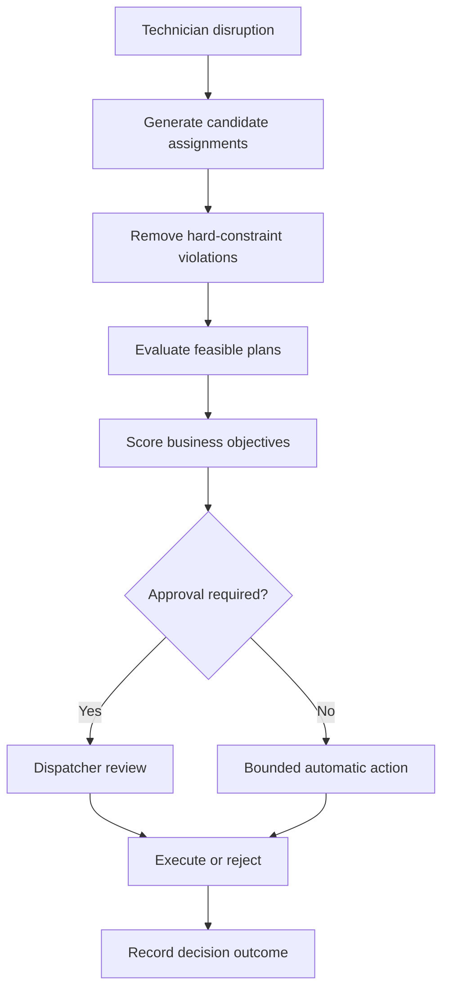

# FieldOps AI

FieldOps AI is an agentic field-service orchestration platform for constraint-based dispatch, dynamic route recovery, human approval, policy optimization, and auditable operational decisions.

**Live application:** [fieldops-ai.mpalm2025.chatgpt.site](https://fieldops-ai.mpalm2025.chatgpt.site)

## The operational problem

Field-service schedules deteriorate when technicians become unavailable, appointments run long, parts are missing, or urgent work arrives. Dispatchers must quickly determine which appointments can be preserved, which technicians are qualified, and which recovery plan creates the lowest operational cost without violating customer commitments.

FieldOps AI demonstrates how a bounded decision system can evaluate those tradeoffs while keeping consequential actions under human control.

## Current capabilities

- Live dispatch command center with route, technician, SLA, mileage, and risk indicators
- Deterministic recovery optimizer that evaluates technician reassignment combinations
- Hard constraints for certification, territory, parts, shift availability, and route capacity
- Weighted business objectives for SLA protection, travel, workload, overtime, and schedule stability
- Dynamic policy controls that recalculate the recommended plan
- Human approval boundary for customer rescheduling and other consequential actions
- Explainable recovery plans with rejected candidates, assignment impact, and decision criteria
- Authenticated operator roles for dispatcher, supervisor, and admin actions
- Durable D1 state for technicians, work orders, policies, disruptions, plans, assignments, and audits
- Idempotent event ingestion and optimistic concurrency checks for policies and plan transitions
- Guarded plan lifecycle with approval, execution, rejection, and compensating rollback
- Immutable decision stream backed by operational audit records
- AgentOps control tower for fleet health, cost, latency, escalation, and incident monitoring
- Versioned agent release pipeline with evaluation, shadow, production, and rollback stages
- Five enforced release gates covering task success, policy compliance, hallucinations, tool accuracy, and latency
- Immutable evaluation runs with deterministic 500-case suites and categorized failure evidence
- Server-enforced promotion controls that block unsafe agent versions
- Evidence-grounded technician diagnostics with ranked hypotheses, cited sources, safety acknowledgement, and parts availability
- Versioned diagnostic runs, immutable tool execution, escalation, and first-time-fix outcome capture
- Versioned 14-day demand forecasts with backtest WAPE, bias, prediction-interval coverage, and skill-level capacity risk
- Capacity scenarios for demand, technician availability, overtime, and cross-trained staffing with explicit supervisor approval
- Enterprise-scale benchmark suite across 1,000 to 100,000 synthetic work orders
- Measured constraint-kernel throughput and p95 shard latency with deterministic replay verification
- Five regression gates for profile completion, determinism, hard constraints, throughput, and tail latency
- Durable benchmark history, baseline comparisons, audit evidence, and downloadable CSV reports
- Structured browser tools for dispatch, governance, diagnostics, forecasting, capacity planning, and benchmark execution
- Responsive desktop and mobile interface

## Demonstration workflow

1. Select **Simulate disruption** to make technician `T-274` unavailable.
2. Observe the resulting changes to SLA, mileage, and at-risk appointments.
3. Open **Review recovery plan**.
4. Inspect proposed assignments, customer impact, hard-constraint validation, and solver evidence.
5. Select **Approve and execute** to apply the five reassignments and queue two reschedules.
6. Inspect the persisted audit events in the decision stream.
7. As an admin, use **Roll back execution** to restore the original work-order assignments through a compensating action.
8. Open **Policy controls**, change an operational priority, and save a new version for the next recovery evaluation.
9. Select **AgentOps** in the navigation to inspect the operational AI fleet.
10. Compare the Dispatch Agent and Recovery Agent candidates, run their evaluation suites, and inspect the failed gates.
11. Promote the passing Dispatch Agent candidate through shadow and production, then test the controlled production rollback.
12. Select **Diagnostic Copilot** to inspect the linked service case, evidence, and inventory results.
13. Acknowledge the safety boundary, accept a verification path, and record the technician outcome.
14. Select **Capacity Planning** to inspect the 14-day demand forecast, uncertainty ceiling, and skill-level staffing risk.
15. Stress demand and availability, evaluate a capacity scenario, and approve the bounded workforce-planning handoff.
16. Select **Simulation Lab** to inspect the latest enterprise-scale benchmark and release regression gates.
17. Run a new benchmark suite, compare it with the previous baseline, and export the persisted CSV evidence report.

## Optimization model

The current scenario contains seven affected service appointments and three eligible receiving technicians. The solver performs a bounded exhaustive search across the candidate assignment space.

Under the default policy, it:

- evaluates 896 capacity-valid assignment combinations
- identifies 150 plans that preserve the required five appointments
- excludes ineligible candidates before weighted scoring
- selects the highest-scoring feasible plan

Hard constraints are never converted into weighted preferences. An assignment that violates certification, territory, parts availability, shift availability, or technician capacity is not eligible for scoring.

## Enterprise benchmark model

The benchmark runs the server-side hard-constraint and scoring kernel against four deterministic synthetic workload profiles. Every profile is replayed three times with the same seed so the suite can verify identical output checksums while measuring actual execution time.

| Profile | Work orders | Technicians | Territories |
|---|---:|---:|---:|
| Small operation | 1,000 | 80 | 4 |
| Regional network | 10,000 | 500 | 12 |
| Enterprise network | 50,000 | 2,500 | 30 |
| Peak enterprise load | 100,000 | 5,000 | 50 |

The suite passes only when all profiles complete, all deterministic replays match, no invalid assignment crosses the hard-constraint guard, throughput remains above 25,000 evaluations per second, and p95 latency for a 1,000-record shard stays at or below 150 milliseconds.

These measurements cover the bounded computation kernel only. They exclude live routing providers, network calls, database ingestion, browser rendering, and end-to-end production traffic, so they are regression evidence rather than a production capacity guarantee.

The remaining feasible plans are scored using normalized policy weights:

| Objective | Default weight |
|---|---:|
| SLA protection | 35% |
| Travel efficiency | 25% |
| Technician load | 20% |
| Overtime reduction | 15% |
| Schedule stability | 5% |

## Decision flow



## Technology

- Next.js 16 and React 19
- TypeScript
- Standard Next.js Node.js runtime on the Railway deployment branch
- Tailwind CSS
- Radix UI and shadcn-compatible interface primitives
- Lucide icons
- WebMCP-compatible structured browser actions
- Railway PostgreSQL with generated, forward-only Drizzle migrations

## Project structure

```text
app/
  page.tsx                 Dispatch interface and operator workflows
  globals.css              Application theme and responsive layout
components/ui/             Accessible interface primitives
lib/
  dispatch-optimizer.ts    Constraints, search, scoring, and plan output
  server/                  Authentication, persistence, lifecycle, and audit services
app/api/
  operations/              Durable command-center snapshot
  disruptions/             Idempotent operational event ingestion
  policy/                  Version-guarded policy updates
  recovery-plans/          Role-guarded plan transitions
  agentops/                Fleet snapshot, evaluations, promotions, and rollback
  diagnostics/             Grounded analysis, technician decisions, escalation, and outcomes
  capacity/                Forecast generation, scenario evaluation, and capacity-plan approval
  benchmarks/              Scale-suite execution and downloadable benchmark evidence
components/
  agentops-control-tower.tsx  Agent fleet governance and release interface
  technician-diagnostic-copilot.tsx  Evidence-grounded field diagnostic workflow
  capacity-planning.tsx    Demand forecasting and capacity scenario workspace
  simulation-benchmark.tsx Enterprise benchmark, regression gates, and report workspace
db/
  schema.ts                Indexed operational data model
drizzle/                   Generated schema migration and metadata
drizzle-postgres/          PostgreSQL migration set for Railway
public/
  favicon.svg              FieldOps AI application icon
railway.json               Railway build, migration, health, and runtime policy
```

## Engineering boundaries

The current version is a portfolio prototype using synthetic operational data. The optimization and benchmark logic is real and deterministic and executes on the server. The browser also computes a non-authoritative policy preview before saving.

The implementation demonstrates production-oriented controls, but it is not connected to a live field-service platform. External dispatch, customer-notification, inventory, and routing integrations remain simulated boundaries. Execution updates durable work-order state, while rollback is implemented as an explicit compensating transaction with its own audit event.

## Roadmap

- [x] Dispatch command interface
- [x] Disruption and recovery workflow
- [x] Constraint-based optimization
- [x] Configurable business policies
- [x] Persistent operational backend and event pipeline
- [x] AgentOps monitoring and evaluation control tower
- [x] Technician diagnostic copilot
- [x] Demand forecasting and capacity planning
- [x] Enterprise-scale simulation and benchmark report

## Portfolio focus

This project is designed to demonstrate more than AI-assisted user interaction. Its focus is operational decision architecture: translating a business disruption into constrained alternatives, measurable tradeoffs, explicit autonomy limits, human review, and an auditable outcome.
