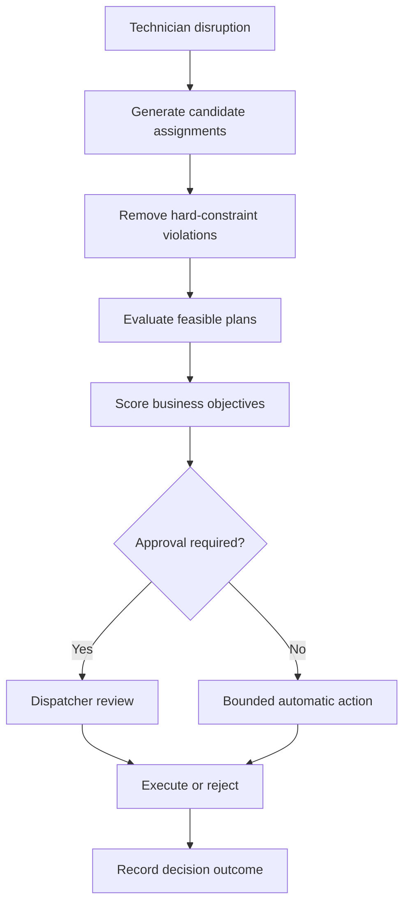

# FieldOps AI

FieldOps AI is an agentic field-service orchestration platform for constraint-based dispatch, dynamic route recovery, human approval, policy optimization, and auditable operational decisions.

**Live application:** [fieldops-ai.mpalm2025.chatgpt.site](https://fieldops-ai.mpalm2025.chatgpt.site)

## The operational problem

Field-service schedules deteriorate when technicians become unavailable, appointments run long, parts are missing, or urgent work arrives. Dispatchers must quickly determine which appointments can be preserved, which technicians are qualified, and which recovery plan creates the lowest operational cost without violating customer commitments.

FieldOps AI demonstrates how a bounded decision system can evaluate those tradeoffs while keeping consequential actions under human control.

## Current capabilities

- Live dispatch command center with route, technician, SLA, mileage, and risk indicators
- Deterministic recovery optimizer that evaluates technician reassignment combinations
- Hard constraints for certification, territory, parts, shift availability, and route capacity
- Weighted business objectives for SLA protection, travel, workload, overtime, and schedule stability
- Dynamic policy controls that recalculate the recommended plan
- Human approval boundary for customer rescheduling and other consequential actions
- Explainable recovery plans with rejected candidates, assignment impact, and decision criteria
- Structured browser tools for agent-accessible simulation, policy updates, and plan execution
- Responsive desktop and mobile interface

## Demonstration workflow

1. Select **Simulate disruption** to make technician `T-274` unavailable.
2. Observe the resulting changes to SLA, mileage, and at-risk appointments.
3. Open **Review recovery plan**.
4. Inspect proposed assignments, customer impact, hard-constraint validation, and solver evidence.
5. Open **Policy controls** and change an operational priority.
6. Return to the recovery plan to see the recalculated recommendation.
7. Select **Accept and execute** to complete the controlled recovery workflow.

## Optimization model

The current scenario contains seven affected service appointments and three eligible receiving technicians. The solver performs a bounded exhaustive search across the candidate assignment space.

Under the default policy, it:

- evaluates 896 capacity-valid assignment combinations
- identifies 150 plans that preserve the required five appointments
- excludes ineligible candidates before weighted scoring
- selects the highest-scoring feasible plan

Hard constraints are never converted into weighted preferences. An assignment that violates certification, territory, parts availability, shift availability, or technician capacity is not eligible for scoring.

The remaining feasible plans are scored using normalized policy weights:

| Objective | Default weight |
|---|---:|
| SLA protection | 35% |
| Travel efficiency | 25% |
| Technician load | 20% |
| Overtime reduction | 15% |
| Schedule stability | 5% |

## Decision flow



## Technology

- Next.js 16 and React 19
- TypeScript
- Vinext and Cloudflare Workers
- Tailwind CSS
- Radix UI and shadcn-compatible interface primitives
- Lucide icons
- WebMCP-compatible structured browser actions

## Project structure

```text
app/
  page.tsx                 Dispatch interface and operator workflows
  globals.css              Application theme and responsive layout
components/ui/             Accessible interface primitives
lib/
  dispatch-optimizer.ts    Constraints, search, scoring, and plan output
public/
  favicon.svg              FieldOps AI application icon
```

## Engineering boundaries

The current version is a portfolio prototype using synthetic operational data. The optimization logic is real and deterministic, but it currently executes in the browser. It does not yet represent a production dispatch system.

The next architecture phase moves operational state and optimization to a server-side service with:

- persistent technicians, appointments, routes, skills, parts, and policies
- disruption event ingestion
- recovery-plan lifecycle management
- idempotent execution
- optimistic concurrency control
- immutable decision audits
- authorization boundaries
- rollback and integration-failure handling

## Roadmap

- [x] Dispatch command interface
- [x] Disruption and recovery workflow
- [x] Constraint-based optimization
- [x] Configurable business policies
- [ ] Persistent operational backend and event pipeline
- [ ] AgentOps monitoring and evaluation control tower
- [ ] Technician diagnostic copilot
- [ ] Demand forecasting and capacity planning
- [ ] Enterprise-scale simulation and benchmark report

## Portfolio focus

This project is designed to demonstrate more than AI-assisted user interaction. Its focus is operational decision architecture: translating a business disruption into constrained alternatives, measurable tradeoffs, explicit autonomy limits, human review, and an auditable outcome.
