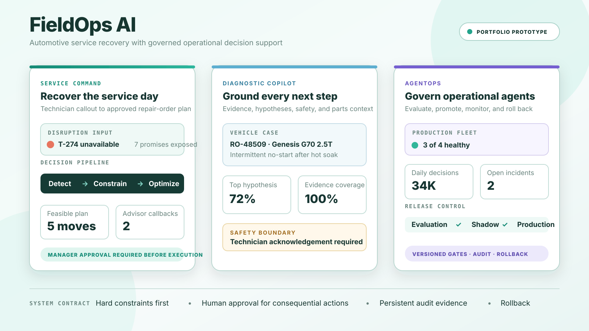
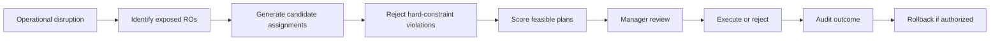

# FieldOps AI | Automotive Service Operations

[](https://github.com/mpalmer79/fieldops-ai/actions/workflows/quality.yml)


**Live application:** [fieldops-ai.up.railway.app](https://fieldops-ai.up.railway.app/)

FieldOps AI is a production-oriented portfolio prototype for dealership service operations. It models how a service department can recover from technician callouts, capacity failures, diagnostic overruns, and customer-promise risk without silently violating operating constraints.

The core idea is simple: **detect what changed, remove impossible recovery options, evaluate feasible alternatives, require human approval where the decision is consequential, and preserve an auditable record of what happened.**



## Why this project exists

Dealership service plans start degrading as soon as reality diverges from the schedule. A technician becomes unavailable. Diagnostic work expands. Parts are delayed. An urgent repair order arrives. A manager then has to answer several questions at once:

- Which customer promises are now at risk?
- Which technicians are actually qualified to receive the work?
- Which assignments violate capacity, certification, equipment, parts, or shift constraints?
- Which feasible plan creates the best operational outcome?
- Which actions can be automated and which require manager approval?
- Can the resulting decision be explained, audited, and rolled back?

FieldOps AI turns that decision problem into a bounded operating workflow instead of a generic chatbot experience.

## What makes it different

This project is intentionally broader than an LLM wrapper. The primary system behavior is implemented through persisted operational state, deterministic optimization, explicit constraints, approval contracts, and auditable lifecycle transitions.

| Area | What is demonstrated |
| --- | --- |
| Recovery optimization | Exhaustive bounded search across technician reassignment combinations with hard-constraint elimination before scoring |
| Human control | Explicit manager approval before consequential repair-order execution |
| Explainability | Rejected candidates, plan impact, policy weights, assignment evidence, and decision-state history |
| Persistent operations | PostgreSQL-backed technicians, work orders, policies, disruptions, plans, assignments, diagnostics, capacity scenarios, benchmarks, and audits |
| AgentOps | Evaluation gates, shadow and production states, incidents, inference cost, promotion controls, and rollback |
| Diagnostics | Evidence-grounded hypotheses, verification paths, parts availability, safety acknowledgement, escalation, and first-time-fix outcome capture |
| Capacity planning | Versioned 14-day forecasts, backtest WAPE, bias, interval coverage, skill-level staffing risk, and bounded planning scenarios |
| Simulation | Deterministic benchmark workloads from 1,000 to 100,000 repair orders with throughput, latency, replay, and regression evidence |
| Context assistant | A deterministic in-app knowledge assistant for product, architecture, workspace, and creator context. It does not call Claude, OpenAI, or another external model. |

## Product tour

FieldOps AI is organized into nine addressable workspaces:

1. **Service Command** - model a technician disruption, inspect customer exposure, validate recovery constraints, review the recommended plan, approve execution, and inspect audit evidence.
2. **Shop Board** - see bay occupancy, repair-order flow, and customer-promise risk in one operating view.
3. **Repair Orders** - trace promise progression, work state, and the next operational action.
4. **Technicians** - compare workload, availability, certification coverage, and assignment risk.
5. **Performance** - track promise attainment, shop efficiency, cycle time, comeback rate, and recovery impact.
6. **Capacity Planning** - inspect the 14-day demand forecast, uncertainty, and skill-level capacity risk before the schedule breaks.
7. **Simulation Lab** - stress the recovery engine across dealership-scale workload profiles and verify release-readiness gates.
8. **Diagnostic Copilot** - work through a synthetic vehicle case using evidence, hypotheses, verification paths, safety controls, and parts context.
9. **AgentOps** - evaluate, promote, monitor, and roll back operational agents under explicit release gates.

A persistent **FieldOps Context Assistant** is available throughout the application. It answers from curated local project knowledge and is deliberately deterministic so a portfolio reviewer gets consistent product, architecture, and creator context without an external model dependency.

## Demonstration workflow

A reviewer can understand the main operating loop in a few minutes:

1. Open **Service Command**.
2. Select **Run disruption** to make technician `T-274` unavailable.
3. Observe the resulting customer-promise and capacity exposure.
4. Inspect hard-constraint evidence and the recommended recovery plan.
5. Open **Review recovery plan**.
6. Approve and execute the persisted plan.
7. Inspect the resulting repair-order changes and audit events.
8. Open **Policy controls**, change an operating priority, and save a new policy version.
9. Visit **AgentOps**, **Diagnostic Copilot**, **Capacity Planning**, and **Simulation Lab** to inspect the broader governance and decision-support architecture.
10. Open the **FieldOps Context Assistant** and ask who built the project for direct links to the creator's LinkedIn, GitHub, and portfolio.

## Recovery model

The reference disruption contains seven affected repair orders and three eligible receiving technicians. The server-side optimizer performs a bounded exhaustive search across candidate assignments.

The sequence is deliberate:



Hard constraints are never converted into preferences. A plan that violates OEM certification, bay or equipment access, parts availability, shift availability, or technician capacity is removed before business-objective scoring.

The remaining feasible plans use normalized policy weights:

| Objective | Default weight |
| --- | ---: |
| Promise-time protection | 35% |
| Workflow movement | 25% |
| Technician load | 20% |
| Overtime reduction | 15% |
| Schedule stability | 5% |

## Enterprise benchmark model

The benchmark suite runs the server-side constraint and scoring kernel against deterministic synthetic workload profiles and verifies replay consistency, positive and negative constraint fixtures, throughput, and tail latency.

| Profile | Repair orders | Technicians | Rooftops |
| --- | ---: | ---: | ---: |
| Single rooftop | 1,000 | 80 | 4 |
| Regional dealer group | 10,000 | 500 | 12 |
| Enterprise dealer group | 50,000 | 2,500 | 30 |
| Peak service load | 100,000 | 5,000 | 50 |

The regression suite requires all profiles to complete, deterministic replays to match, hard-constraint fixtures to behave correctly, throughput to remain above 500,000 evaluations per second, and p95 latency for a 10,000-record shard to remain at or below 25 milliseconds.

These measurements cover the bounded computation kernel only. They do not claim end-to-end production capacity for network traffic, browser rendering, database ingestion, or external integrations.

## Technology

- Next.js 16 and React 19
- TypeScript
- PostgreSQL on Railway
- Drizzle-generated forward-only migrations
- Tailwind CSS
- Radix UI and shadcn-compatible primitives
- Lucide icons
- WebMCP-compatible structured browser actions
- Vitest and Testing Library
- GitHub Actions quality gate

## Architecture

```text
Browser
  |
  |-- Public landing page
  |-- Nine operational workspaces
  |-- FieldOps Context Assistant
  |
Next.js application
  |
  |-- Service recovery APIs
  |-- Policy lifecycle APIs
  |-- Recovery plan transitions
  |-- AgentOps evaluation and promotion
  |-- Diagnostic workflow APIs
  |-- Forecast and capacity APIs
  |-- Benchmark APIs
  |
Domain layer
  |
  |-- Constraint validation
  |-- Recovery optimizer
  |-- Policy scoring
  |-- Diagnostics logic
  |-- Forecast and benchmark kernels
  |
PostgreSQL
  |
  |-- Operational state
  |-- Versioned policies and plans
  |-- Audit events
  |-- Diagnostics
  |-- Capacity scenarios
  |-- Benchmark evidence
```

## Data provenance

The interface distinguishes live persisted demo state from illustrative or modeled portfolio data.

- **Service Command and Technicians** use persisted application state.
- **Shop Board and Repair Orders** are illustrative reference views built around the service-operations model.
- **Performance** combines live recovery projection with illustrative trend data.
- **Capacity Planning** uses modeled forecasting and planning data.
- **Simulation Lab** reports measured benchmark results from the server-side test kernel.
- **Diagnostic Copilot** uses a synthetic vehicle service case.
- **AgentOps** demonstrates governed operational-agent lifecycle behavior.

Public visitors receive isolated cookie-backed demo workspaces so their mutations do not share operational state with other visitors.

## Engineering boundaries

This is a **portfolio prototype**, not a connected dealership production system.

The optimization, persistence, lifecycle controls, benchmark logic, policy evaluation, and audit behavior are implemented. External dealer systems remain simulated boundaries, including:

- DMS integration
- technician timekeeping
- parts catalog and availability feeds
- OEM service-information providers
- customer messaging
- live scheduling and appointment systems

Execution updates durable repair-order state inside the demo workspace. Rollback is implemented as an explicit compensating transaction with its own audit evidence.

## Quality gates

The repository quality workflow blocks release work unless all of the following pass:

- ESLint
- TypeScript type checking
- unit and interaction tests
- production build

The test suite covers optimizer behavior, benchmark determinism, route contracts, accessibility checks, assistant knowledge behavior, landing-page interaction, and the Service Command recovery flow.

## Project structure

```text
app/
  control-room/[workspace]   Addressable operational workspaces
  api/                       Recovery, policy, AgentOps, diagnostics, capacity, and benchmark endpoints
components/
  service-recovery-command.tsx
  shop-board.tsx
  repair-orders-board.tsx
  technician-command-center.tsx
  performance-command-center.tsx
  capacity-planning.tsx
  simulation-benchmark.tsx
  technician-diagnostic-copilot.tsx
  agentops-control-tower.tsx
  fieldops-assistant.tsx
lib/
  dispatch-optimizer.ts
  fieldops-assistant.ts
  server/
db/
  schema.ts
drizzle-postgres/
tests/
docs/
  fieldops-product-overview.svg
```

## About the builder

**Michael Palmer**  
AI Solutions Engineer | Applied AI, LLM Systems, Workflow Automation | Full-Stack Engineering

Michael combines more than 25 years of automotive retail and dealership operations experience with computer science, software engineering, and applied AI. FieldOps AI is designed around that overlap: real dealership operating constraints expressed as software, decision logic, governance, and measurable system behavior.

- [LinkedIn](https://linkedin.com/in/mpalmer1234)
- [GitHub](https://github.com/mpalmer79)
- [Portfolio](https://mpalmer79.github.io/)

## Portfolio focus

FieldOps AI demonstrates how an operational AI system can be designed around constraints, persistence, explainability, human authorization, measurable performance, and rollback rather than around an unconstrained chat interface.
